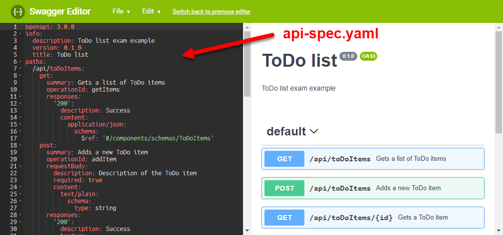

# Aufgabe 1

* Anzahl Punkte: 17
* Kalkulierte Zeit: 40 Minuten

## Einleitung

Ihre Aufgabe ist die Implementierung einer Web API **mit *ASP.NET Core***, die als Backend für ein [TicTacToe-Spiel](https://de.wikipedia.org/wiki/Tic-Tac-Toe) dienen soll.

Die technische Spezifikation der Web API finden Sie im *Open API* Format in [*api-spec.yaml*](api-spec.yaml). Hinweis: Sie können die Spezifikation in einem angenehm lesbaren Format ansehen, indem Sie [https://editor.swagger.io/](https://editor.swagger.io/) im Browser öffnen und den Inhalt der Datei [*api-spec.yaml*](api-spec.yaml) in den Eingabebereich auf der linken Seite kopieren:



**Lesen Sie die API Spezifikation genau!** Auch scheinbare Kleinigkeiten wie zum Beispiel geforderte *Response Codes* (z.B. *404* für *Not Found*, *201* für *Created*) sind wichtig und müssen beachtet werden.

## Anforderungen

Beachten Sie beim Lösen der Aufgabe folgende Anforderungen.

### Pflichtaufgaben (9 Punkte)

Pflichtaufgaben, die alle korrekt gelöst werden müssen, um Punkte für das Beispiel zu erhalten:

* Funktionsfähige, spezifikationsgemäße Umsetzung der Operation *getWinner1* (`POST /api/getWinner`)
* Korrekte Logik für Gewinnerermittlung (drei gleiche Wert waagrecht, senkrecht oder in der Diagonale; siehe auch [Wikipedia](https://de.wikipedia.org/wiki/Tic-Tac-Toe))
* Mindestens ein **Unit Test**, der einen Aspekt des Codes automatisiert auf Korrektheit überprüft

### Optionale Aufgaben

Optionale Aufgaben, um die volle Punktzahl für das Beispiel zu erhalten:

* 2 Punkte: Funktionsfähige, spezifikationsgemäße Umsetzung der Operation *getWinner2* (`GET /api/getWinner?board=...`)
* 2 Punkte: Zwei **Unit Tests**, die die Korrektheit der Gewinnerermittlung für die beiden unten genannten Testfälle *POST Request mit Gewinner* und *POST Request ohne Gewinner* prüfen.
* 1 Punkt: Logik für Gewinnerermittlung ausgegliedert in eine **eigene *.NET Standard* Class Library**
* 2 Punkte: Injizieren der Gewinnerermittlungslogik über [*ASP.NET Core Dependency Injection*](https://docs.microsoft.com/en-us/aspnet/core/fundamentals/dependency-injection#registering-your-own-services)
* 1 Punkt: Guter Programmierstil (z.B. *readme.md*, *.gitignore*, keine unnötigen Dateien eingecheckt, etc.) und effizienter Algorithmus


## Testfälle

### *POST* Request mit Gewinner

Request:

```
POST /api/getWinner
Content-Type: application/json

[" ", "X", "O", 
 "O", "X", " ", 
 " ", "X", "O"]
```

Response:

```
{ "winner": "X" }
```

### *POST* Request ohne Gewinner

Request:

```
POST /api/getWinner
Content-Type: application/json

[" ", "X", "O",
 "O", "X", " ",
 " ", "O", " "]
```

Response:

```
{ "winner": null }
```

### *GET* Request mit Gewinner

Request:

```
GET /api/getWinner?board=,X,O,O,X,,,X,O
```

Response:

```
{ "winner": "X" }
```

### Fehlerhafter POST Request 1

Request:

```
POST /api/getWinner
Content-Type: application/json

[" ", "X", "O",
 "O", "X", " ",
 " ", "O"]
```

### Fehlerhafter POST Request 2

Request:

```
POST /api/getWinner
Content-Type: application/json

"dummy"
```


### Fehlerhafter GET Request

Request:

```
GET /api/getWinner?board=,,,X
```
